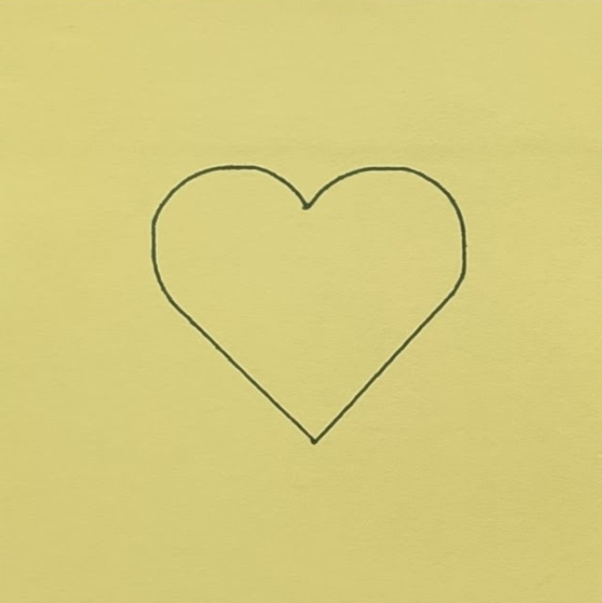
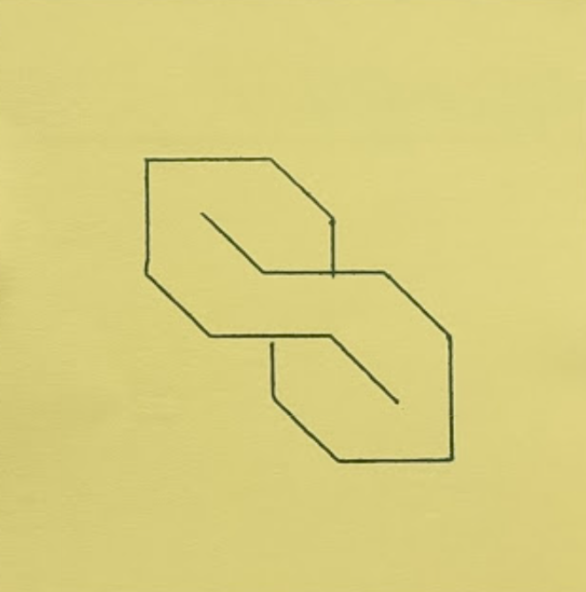

# 2D Plotter Robot

Lucas Jung 324724 ([@gruvw](https://gruvw.com))

EPFL BA6 / MIT CS-358 / 2D Plotter Robot / Personal Project

This **2D Plotter Robot** is a device that can draw user defined drawings on a small sheet of paper based on a provided computer program.

**Note**: this README was also made available as a **PDF** for portability purposes (see `README.pdf`). However, the video won't work and the layout is not perfect on the PDF version (see `README.md` for Markdown based document).

## Result

Here are a few pictures showing the final plotter from different angles.

    
    
    
    
    
    

### Drawings

You can see below some pictures of the drawings that the plotter achieved to draw.

    
    
    
    
    
    
    

Most of the drawings have an impressive precision.  
However, I noticed a small loss of precision when drawing with the 3D printed dynamic penholder.
It is due to a small amount of play that occurs with the moving piece slightly tilting the pen.
It is not noticeable for most of the drawings.

### Video Demonstration

Here is a short video (click on thumbnail to watch) demonstrating the plotter drawing a dashed line.

**Note**: Link of the video for accessibility purposes <https://youtu.be/-nplPBwFOKw>.

## Technical informations

The code for the project was mostly written in **C** (a few `.cpp` and `.ino` were required to interact with the [Arduino](https://www.arduino.cc/) ecosystem).  
To add a bit more to the challenge, I also decided not to use any external libraries (except for the `Arduino.h`).
I wrote the code that manages the servo and the steppers from scratch (see `2d_plotter/src/hardware` for more information).

### Project structure

A short explanation of the project structure in this directory:

- `2d_plotter/src`: contains the source code for the project.
    - `draw/`: basic drawing functionalities.
    - `hardware/`: abstraction layer used to interact with hardware components, exposes helpful functions to control the servo and the steppers in a safe way (automatic software limits).
    - `main/`: entry point of the program along with the three procedures `square_inscribe_circle`, `hilbert_filling`, `turtle_REPL`.
    - `turtle/`: the implementation of the turtle language interpreter.
- `CAD/`: contains all the computer designs.
    - `exports/`: the `.stl` files for the different parts.
- `docs/`: hosts the images used in this README.
- `turtle/`: contains examples of turtle programs that can run on the 2D plotter.

### Turtle language

This project implements a turtle language interpreter/[REPL](https://en.wikipedia.org/wiki/Read–eval–print_loop) (Read Eval Print Loop).

**Note**: learn more about the turtle language here <https://turtleacademy.com/playground>.

No modifications have been made to the original syntax of the language.
It supports multi-lines input (with indentation) and it is not spacing dependent.

You can find examples of programs that ran on the plotter in the `turtle` directory (`.turtle` files).  
The programs should be sent to the Arduino by using the Serial Input monitor.

### Additional information

I added a few other things to the project:

- Two limit switches are used to automatically set the "home"/origin position of the plotter. Before running a program, the plotter will initiate a setup procedure by moving up to the limit switch (in each direction) in order to reset to the home position without human intervention.
- I extended the original turtle instruction set to support the following instructions:
    - `backward <dist>`: goes backward for `<dist>` steps.
    - `circle <radius>`: draws a circle from current position and heading (rotated circle around starting point) of the given `<radius>`.
    - `home`: to return to the home position (always on the same exact spot thanks to the limit switches).
    - `setheading <angle>`: sets the heading of the turtle to the given `<angle>`, useful to rotate drawings (uses a 2D rotation matrix).
- I also added a buzzer connected to the arduino. It gives a nice audio feedback to the person using the plotter about the current state of the procedure (started, ready to draw, finished).
- Well structured source code with abstraction layers over the hardware and drawing functions (directory based separation of concerns).
- Extended documentation, both in the code with comments and here on the `README.md`.
