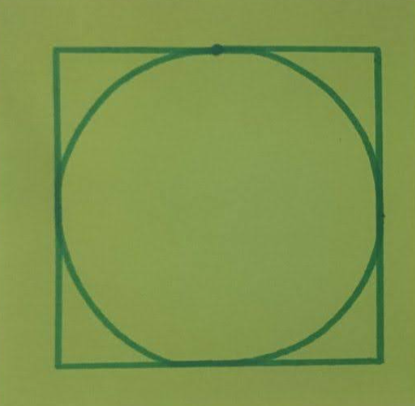
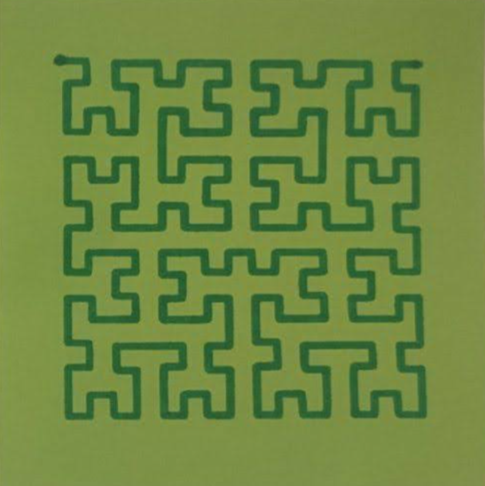
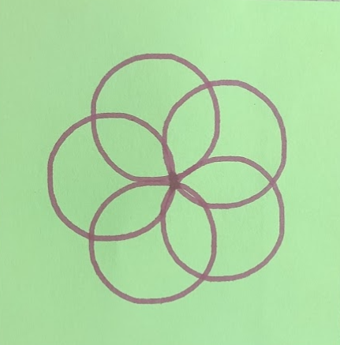
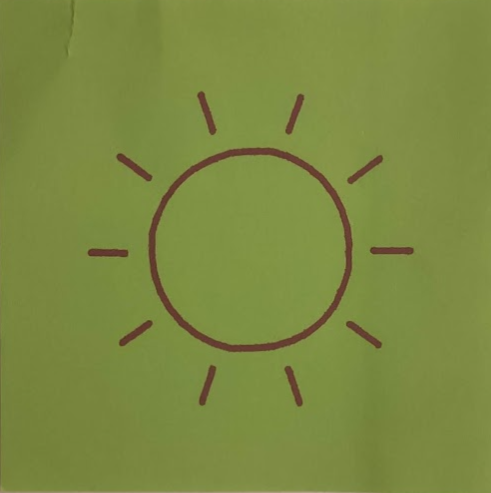
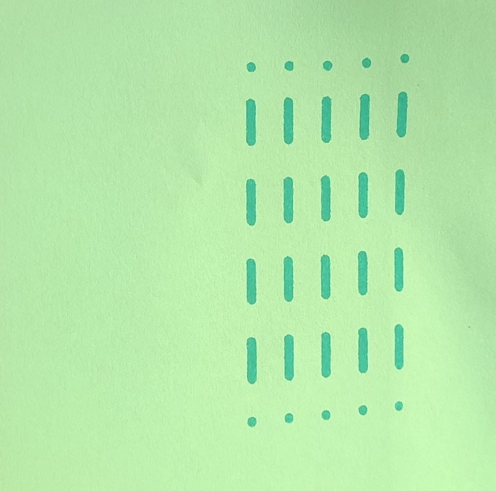

# 2D Plotter Robot

Lucas Jung ([@gruvw](https://gruvw.com))

EPFL BA6 / MIT CS-358 / 2D Plotter Robot / Personal Project

This **2D Plotter Robot** is a device that can draw user defined drawings on a small sheet of paper based on a provided computer program.

## Result

Here are a few pictures showing the final plotter from different angles.

<!-- TODO  add plotter pictures -->

### Drawings

You can see below some pictures of the drawings that the plotter achieved to draw.

    
    
    
    
    

<!-- TODO add drawing of magic S -->

### Video Demonstration

Here is a short video (click on thumbnail to watch) demonstrating the functioning of the plotter.

## Technical informations

The code for the project was mostly written in C (a few `.cpp` and `.ino` when required to interact with the Arduino ecosystem).  
To add a little bit more challenge, I also decided not to use any external libraries (except for the `Arduino.h`).
I wrote the code that manages the servo and the steppers from scratch.

### Project structure

A short explanation of the structure of this repository:

- `2d_plotter/src`: contains the source code for the project.
    - `draw/`: basic drawing functionality.
    - `hardware/`: abstraction layer used to interact with hardware components, exposes helpful functions to control the servo and the steppers in a safe way.
    - `main/`: entry point of the program.
    - `turtle/`: the definition of the turtle language interpreter.
- `CAD/`: contains all the computer designs.
    - `exports/`: the `.stl` files for the different parts.
- `docs/`: hosts the images used in this README.
- `turtle/`: contains examples of turtle program that can run on the 2D plotter.

### Turtle language

This project implements a turtle language interpreter/[REPL](https://en.wikipedia.org/wiki/Read–eval–print_loop) (Read Eval Print Loop).

**Note**: learn more about the turtle language here <https://turtleacademy.com/playground>.

No modifications have been made to the syntax of the language.  
You can find examples of programs that run on the plotter in the `turtle` directory (`.turtle` files).  
The programs should be sent to the Arduino by using the Serial Input monitor.

### Improvements

I added a few things to the plotter:

- Two limit switches are used to set the "home" or origin position of the plotter. Before running a program, the plotter will set up by moving up to the limit switch (in each direction) in order to reset to the home position without human intervention.
- I extended the original turtle instruction set to support the following instructions:
    - `backward <dist>`: goes backward for `<dist>` steps.
    - `circle <radius>`: draws a circle from current position and heading (rotated circle) of the given `<radius>`.
    - `home`: to return to the home position.
    - `setheading <angle>`: sets the heading of the turtle to the given `<angle>`, useful to rotate drawings.
- I also added a buzzer connected to the arduino. It gives a nice audio feedback to the person using the plotter about the current state of the turtle (started, ready to draw, finished).
